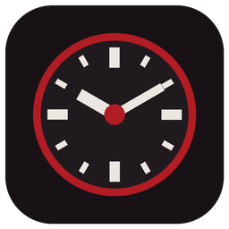

<p align="center">
  
</p>

<h1 align="center">AutoReShade</h1>

<p align="center">
  Automatic ReShade presets and map callout clocks for <b>Dead by Daylight</b>.<br>
  Free, open source, no installation needed.
</p>

---

AutoReShade watches the loading screen, recognises which map you are loading into, and then:

1. **switches ReShade to the preset you chose for that map** (or realm), and
2. **shows that map's callout clock** ("map clock") as a small, semi-transparent overlay above the game.

You never have to alt-tab or press anything during a match.

## Features

- **Automatic map detection.** Reads the realm and map name from the loading screen. Works at any resolution (1080p, 1440p, 4K and more) and in 15 game languages.
- **ReShade preset per map.** Assign a preset to a whole realm, override it for single maps, and set a default preset for everything else. AutoReShade can even assign your presets for you from their file names (for example `11.MyPreset.Macmillan.ini`).
- **Map clock overlay.** Your own clock images, shown above the game. You can change their size, opacity and position. Mouse clicks pass through the overlay, and it can stay hidden whenever the game is not the active window.
- **Hotkeys.** Show/hide the clock, move/resize the overlay, choose a map by hand.
- **Map variants.** Knows the newer layouts such as Coal Tower II, Shelter Woods II and Mount Ormond Resort II/III, so the right clock is shown.
- **Manual fallback.** If a loading screen was missed, press the hotkey (or use the tray menu) and pick the map from a searchable list.
- **Display mode check.** Warns you if the game runs in exclusive Fullscreen, where no overlay can be drawn, and tells you how to fix it.
- **Everything is configurable.** Nothing is tied to one PC. The map list is a separate file, so new maps can be added without changing code.

## Requirements

- Windows 10 or 11 (64-bit)
- Dead by Daylight (Steam, Epic Games Store or Microsoft Store)
- The game's display mode set to **Windowed Fullscreen** (borderless), needed for the clock overlay
- [ReShade](https://reshade.me) installed for Dead by Daylight, needed for preset switching. Use the normal version, **not** the "with full add-on support" version.

Nothing else needs to be installed. AutoReShade is a single `.exe` with everything built in.

## Download and start

1. Download **`AutoReShade.exe`** from the [latest release](../../releases/latest).
2. Put it in any folder you like and double-click it.
3. AutoReShade opens its settings window and puts an icon next to the Windows clock (tray). Closing the window keeps it running in the tray. Use **Exit** in the tray menu to quit.

> **"Windows protected your PC" (SmartScreen):** AutoReShade is new and not code-signed yet, so Windows may warn you. Click **More info** and then **Run anyway**.
>
> **Smart App Control:** if Smart App Control is turned on (Windows Security → App & browser control), Windows blocks unsigned apps completely. In that case you can only run AutoReShade if you turn Smart App Control off. Newer Windows 11 versions let you turn it back on later.

## Setup (about 2 minutes)

### 1. ReShade presets

1. Open the **ReShade** tab. AutoReShade normally finds your ReShade folder by itself (the folder with `ReShade.ini`, usually `...\Dead by Daylight\DeadByDaylight\Binaries\Win64`). If it does not, click **Browse...**.
2. Choose a **Default preset**. It is used for every map that has no preset of its own.
3. Open the **Maps** tab and choose a preset for each realm, or for single maps. Or click **Assign presets from file names**: AutoReShade assigns presets whose file names contain a realm or map name (for example "Macmillan", "Coldwind Farm", "The Game", "Saloon").
4. **Restart Dead by Daylight.** ReShade reads its settings when the game starts.

### 2. Map clocks

AutoReShade does not include any clock images, because they belong to their creators. Use your own or ones you are allowed to use. A popular complete set is the clock callouts by **Hens333**, which you can view and save from [DBD Campfire](https://dbdcampfire.dev/clock-callouts). Please credit the creator if you share them.

1. On the **Maps** tab click **Open clocks folder**.
2. Copy your clock images (PNG or JPG) into that folder. Name each file after its map, for example `Coal Tower.png`, `Badham Preschool III.png` or `Midwich.png`.
3. Click **Assign clocks from folder**. You can also pick an image for each map by hand with the **Clock...** button.
4. On the **Clock overlay** tab set the size and opacity, then click **Move / resize overlay...** to drag the clock where you want it. Use the mouse wheel to resize it and press **Enter** when you are done.

### 3. Display mode

In Dead by Daylight open **Settings → Graphics** and set the window/display mode to **Windowed Fullscreen**. The overlay cannot appear above exclusive Fullscreen. Preset switching works in every mode.

## Default hotkeys

| Action | Key |
|---|---|
| Show / hide the clock overlay | `F8` |
| Move / resize the overlay | `Shift+F8` |
| Choose the map by hand | `F9` |

You can change them on the **Hotkeys** tab.

## How it works

- **Map detection:** while Dead by Daylight is the active window, AutoReShade takes a screenshot of the lower-left part of the game window every 1.5 seconds and reads the text with the built-in [Tesseract](https://github.com/tesseract-ocr/tesseract) OCR engine. When the loading screen shows a known map name, that map becomes active. Each check takes about 0.2 seconds of CPU time and nothing is ever sent anywhere.
- **Preset switching:** ReShade has a built-in feature to switch presets with a keyboard shortcut (`PresetShortcutKeys` in `ReShade.ini`). AutoReShade gives every preset you use its own shortcut, using keys that no keyboard has (F13-F24 and unassigned key codes), so they never clash with your bindings. When a map is detected, AutoReShade presses that key while the game is focused. Your original `ReShade.ini` is backed up as `ReShade.ini.autoreshade-backup`.
- **Overlay:** the clock is a separate, transparent, always-on-top window that mouse clicks pass through. It is drawn by Windows above the game, not inside it.

## Anti-cheat and fair play

Dead by Daylight uses Easy Anti-Cheat. AutoReShade was designed to stay well away from it. AutoReShade **never**:

- reads or changes the game's memory,
- injects anything into the game process,
- changes any game files.

It only takes screenshots, reads text from them, presses ReShade's own preset shortcut keys and shows its own window. It writes only to ReShade's settings file (`ReShade.ini`). To check the display mode it reads, but never changes, the game's `GameUserSettings.ini`. Other popular map-overlay tools use the same screenshot-and-text approach.

Behaviour Interactive has stated that using ReShade is not bannable. Easy Anti-Cheat sometimes blocks the newest ReShade release for a while; if ReShade stops loading after an update, use the previous ReShade version.

**Use AutoReShade at your own risk.** Game rules and anti-cheat behaviour can change at any time, and this project cannot guarantee how they will treat any third-party tool.

## Adding maps or languages

The built-in map list ([`maps.json`](src/AutoReShade.Core/Data/maps.json)) contains every realm and map with names in 15 languages. To add a new map or a translation without waiting for an update, create `custom-maps.json` in the AutoReShade data folder (**General** tab → **Open data folder**):

```json
{
  "realms": [
    {
      "id": "the-macmillan-estate",
      "names": { "en": "The MacMillan Estate" },
      "maps": [
        { "id": "brand-new-map", "names": { "en": "Brand New Map", "pl": "Zupełnie Nowa Mapa" } }
      ]
    }
  ]
}
```

Then click **Reload map list** on the **Maps** tab. Entries with an existing `id` add names to that realm or map; new ids add new realms or maps.

Latin-script languages are read with the built-in English OCR model. For Russian, Japanese, Korean, Chinese or Thai, download the matching file (for example `rus.traineddata`) from [tessdata_fast](https://github.com/tesseract-ocr/tessdata_fast), put it in the `tessdata` folder (**Map detection** tab → **Advanced**) and restart AutoReShade.

## Troubleshooting

- **The map is not detected:** open the **Map detection** tab and click **Test with a screenshot file...** with a screenshot of a loading screen (F12 in Steam saves one). You will see what the text reader sees and what it found. The **Advanced** section lets you change the area that is read and the text brightness.
- **The preset does not change:** make sure you restarted the game after assigning presets, and that the ReShade tab says "ReShade ... found - ReShade.ini found".
- **The overlay is not visible:** check that the game runs in Windowed Fullscreen, that a clock image is assigned to the map, and that the overlay is not hidden (`F8`).
- **Logs and settings** are in `%APPDATA%\AutoReShade` (**General** tab → **Open data folder** / **Open log file**).

## Building from source

Requires the [.NET 10 SDK](https://dotnet.microsoft.com/download).

```powershell
dotnet test                                                      # run the tests
dotnet publish src/AutoReShade -c Release -o artifacts/publish   # build the single-file AutoReShade.exe
```

Project layout:

- `src/AutoReShade.Core` - map list, OCR pipeline, map name matching, ReShade.ini handling, settings
- `src/AutoReShade` - the Windows app (WPF): settings window, overlay, tray icon, hotkeys, game watcher
- `tests/AutoReShade.Tests` - unit tests and end-to-end OCR tests on synthetic loading screens

## Disclaimer

AutoReShade is a free fan project. It is **not affiliated with, endorsed by or supported by Behaviour Interactive Inc.** or the ReShade project. Dead by Daylight and all related names are trademarks of Behaviour Interactive Inc. ReShade is developed by crosire. This repository contains no game assets, no clock images and no ReShade files.

## License

[MIT](LICENSE). Third-party components and their licenses are listed in [THIRD-PARTY-NOTICES.md](THIRD-PARTY-NOTICES.md).
